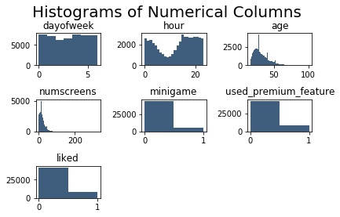
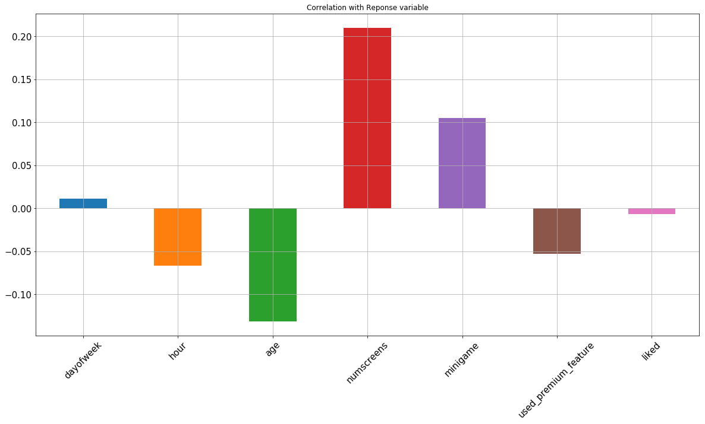
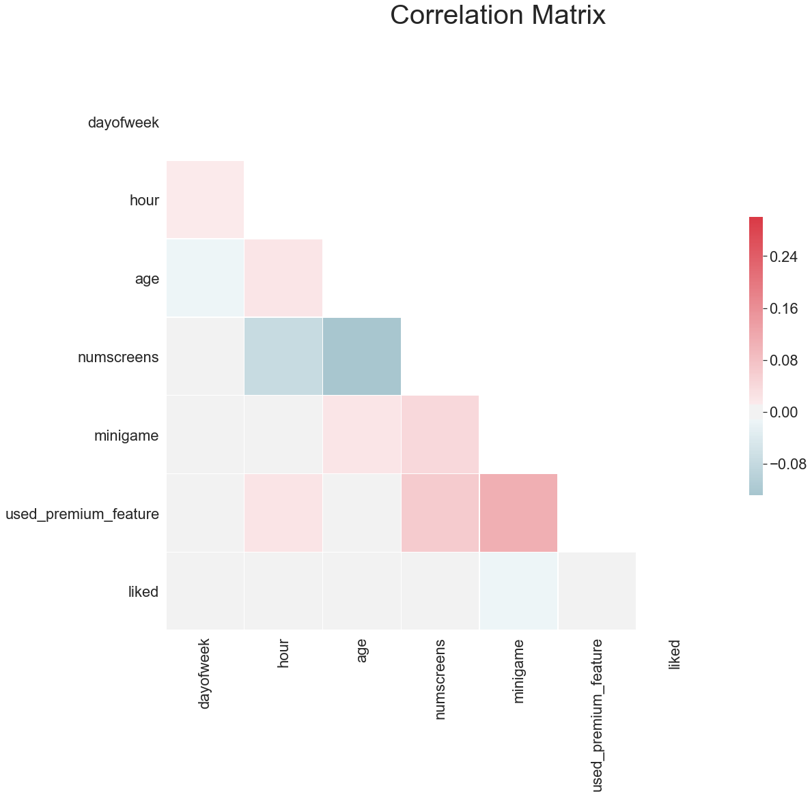
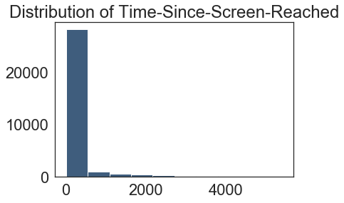
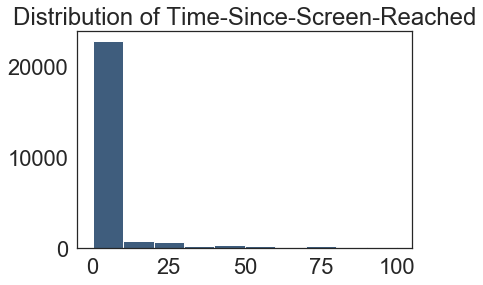
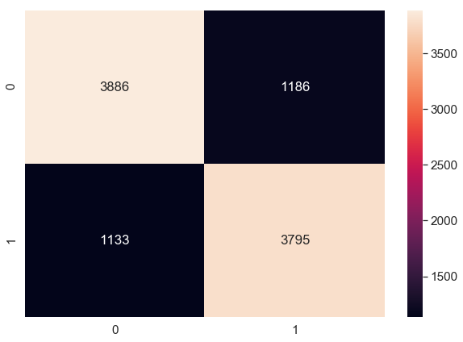

```python
#### Importing Libraries ####

import pandas as pd
from dateutil import parser
import matplotlib.pyplot as plt
import numpy as np
import seaborn as sn
```


```python
# import the data
dataset = pd.read_csv('/Users/monipeni/Documents/Machine Learning Practical/Module 3/appdata10.csv')
```


```python
# Viewing the Data
dataset.head(10) 
```


<div>
<style scoped>
    .dataframe tbody tr th:only-of-type {
        vertical-align: middle;
    }

    .dataframe tbody tr th {
        vertical-align: top;
    }

    .dataframe thead th {
        text-align: right;
    }
</style>
<table border="1" class="dataframe">
  <thead>
    <tr style="text-align: right;">
      <th></th>
      <th>user</th>
      <th>first_open</th>
      <th>dayofweek</th>
      <th>hour</th>
      <th>age</th>
      <th>screen_list</th>
      <th>numscreens</th>
      <th>minigame</th>
      <th>used_premium_feature</th>
      <th>enrolled</th>
      <th>enrolled_date</th>
      <th>liked</th>
    </tr>
  </thead>
  <tbody>
    <tr>
      <th>0</th>
      <td>235136</td>
      <td>2012-12-27 02:14:51.273</td>
      <td>3</td>
      <td>02:00:00</td>
      <td>23</td>
      <td>idscreen,joinscreen,Cycle,product_review,ScanP...</td>
      <td>15</td>
      <td>0</td>
      <td>0</td>
      <td>0</td>
      <td>NaN</td>
      <td>0</td>
    </tr>
    <tr>
      <th>1</th>
      <td>333588</td>
      <td>2012-12-02 01:16:00.905</td>
      <td>6</td>
      <td>01:00:00</td>
      <td>24</td>
      <td>joinscreen,product_review,product_review2,Scan...</td>
      <td>13</td>
      <td>0</td>
      <td>0</td>
      <td>0</td>
      <td>NaN</td>
      <td>0</td>
    </tr>
    <tr>
      <th>2</th>
      <td>254414</td>
      <td>2013-03-19 19:19:09.157</td>
      <td>1</td>
      <td>19:00:00</td>
      <td>23</td>
      <td>Splash,Cycle,Loan</td>
      <td>3</td>
      <td>0</td>
      <td>1</td>
      <td>0</td>
      <td>NaN</td>
      <td>1</td>
    </tr>
    <tr>
      <th>3</th>
      <td>234192</td>
      <td>2013-07-05 16:08:46.354</td>
      <td>4</td>
      <td>16:00:00</td>
      <td>28</td>
      <td>product_review,Home,product_review,Loan3,Finan...</td>
      <td>40</td>
      <td>0</td>
      <td>0</td>
      <td>1</td>
      <td>2013-07-05 16:11:49.513</td>
      <td>0</td>
    </tr>
    <tr>
      <th>4</th>
      <td>51549</td>
      <td>2013-02-26 18:50:48.661</td>
      <td>1</td>
      <td>18:00:00</td>
      <td>31</td>
      <td>idscreen,joinscreen,Cycle,Credit3Container,Sca...</td>
      <td>32</td>
      <td>0</td>
      <td>0</td>
      <td>1</td>
      <td>2013-02-26 18:56:37.841</td>
      <td>1</td>
    </tr>
    <tr>
      <th>5</th>
      <td>56480</td>
      <td>2013-04-03 09:58:15.752</td>
      <td>2</td>
      <td>09:00:00</td>
      <td>20</td>
      <td>idscreen,Cycle,Home,ScanPreview,VerifyPhone,Ve...</td>
      <td>14</td>
      <td>0</td>
      <td>0</td>
      <td>1</td>
      <td>2013-04-03 09:59:03.291</td>
      <td>0</td>
    </tr>
    <tr>
      <th>6</th>
      <td>144649</td>
      <td>2012-12-25 02:33:18.461</td>
      <td>1</td>
      <td>02:00:00</td>
      <td>35</td>
      <td>product_review,product_review2,ScanPreview</td>
      <td>3</td>
      <td>0</td>
      <td>0</td>
      <td>0</td>
      <td>NaN</td>
      <td>0</td>
    </tr>
    <tr>
      <th>7</th>
      <td>249366</td>
      <td>2012-12-11 03:07:49.875</td>
      <td>1</td>
      <td>03:00:00</td>
      <td>26</td>
      <td>Splash,Cycle,Home,Credit3Container,Credit3Dash...</td>
      <td>41</td>
      <td>0</td>
      <td>1</td>
      <td>0</td>
      <td>NaN</td>
      <td>0</td>
    </tr>
    <tr>
      <th>8</th>
      <td>372004</td>
      <td>2013-03-20 14:22:01.569</td>
      <td>2</td>
      <td>14:00:00</td>
      <td>29</td>
      <td>product_review,product_review2,ScanPreview,Ver...</td>
      <td>33</td>
      <td>1</td>
      <td>1</td>
      <td>1</td>
      <td>2013-04-27 22:24:54.542</td>
      <td>0</td>
    </tr>
    <tr>
      <th>9</th>
      <td>338013</td>
      <td>2013-04-26 18:22:16.013</td>
      <td>4</td>
      <td>18:00:00</td>
      <td>26</td>
      <td>Home,Loan2,product_review,product_review,produ...</td>
      <td>19</td>
      <td>0</td>
      <td>0</td>
      <td>1</td>
      <td>2013-04-26 18:31:58.923</td>
      <td>0</td>
    </tr>
  </tbody>
</table>
</div>


```python
# Distribution of Numerical Variables
dataset.describe()
```


<div>
<style scoped>
    .dataframe tbody tr th:only-of-type {
        vertical-align: middle;
    }

    .dataframe tbody tr th {
        vertical-align: top;
    }

    .dataframe thead th {
        text-align: right;
    }
</style>
<table border="1" class="dataframe">
  <thead>
    <tr style="text-align: right;">
      <th></th>
      <th>user</th>
      <th>dayofweek</th>
      <th>age</th>
      <th>numscreens</th>
      <th>minigame</th>
      <th>used_premium_feature</th>
      <th>enrolled</th>
      <th>liked</th>
    </tr>
  </thead>
  <tbody>
    <tr>
      <th>count</th>
      <td>50000.000000</td>
      <td>50000.000000</td>
      <td>50000.00000</td>
      <td>50000.000000</td>
      <td>50000.000000</td>
      <td>50000.000000</td>
      <td>50000.000000</td>
      <td>50000.000000</td>
    </tr>
    <tr>
      <th>mean</th>
      <td>186889.729900</td>
      <td>3.029860</td>
      <td>31.72436</td>
      <td>21.095900</td>
      <td>0.107820</td>
      <td>0.172020</td>
      <td>0.621480</td>
      <td>0.165000</td>
    </tr>
    <tr>
      <th>std</th>
      <td>107768.520361</td>
      <td>2.031997</td>
      <td>10.80331</td>
      <td>15.728812</td>
      <td>0.310156</td>
      <td>0.377402</td>
      <td>0.485023</td>
      <td>0.371184</td>
    </tr>
    <tr>
      <th>min</th>
      <td>13.000000</td>
      <td>0.000000</td>
      <td>16.00000</td>
      <td>1.000000</td>
      <td>0.000000</td>
      <td>0.000000</td>
      <td>0.000000</td>
      <td>0.000000</td>
    </tr>
    <tr>
      <th>25%</th>
      <td>93526.750000</td>
      <td>1.000000</td>
      <td>24.00000</td>
      <td>10.000000</td>
      <td>0.000000</td>
      <td>0.000000</td>
      <td>0.000000</td>
      <td>0.000000</td>
    </tr>
    <tr>
      <th>50%</th>
      <td>187193.500000</td>
      <td>3.000000</td>
      <td>29.00000</td>
      <td>18.000000</td>
      <td>0.000000</td>
      <td>0.000000</td>
      <td>1.000000</td>
      <td>0.000000</td>
    </tr>
    <tr>
      <th>75%</th>
      <td>279984.250000</td>
      <td>5.000000</td>
      <td>37.00000</td>
      <td>28.000000</td>
      <td>0.000000</td>
      <td>0.000000</td>
      <td>1.000000</td>
      <td>0.000000</td>
    </tr>
    <tr>
      <th>max</th>
      <td>373662.000000</td>
      <td>6.000000</td>
      <td>101.00000</td>
      <td>325.000000</td>
      <td>1.000000</td>
      <td>1.000000</td>
      <td>1.000000</td>
      <td>1.000000</td>
    </tr>
  </tbody>
</table>
</div>


```python
# First set of Feature cleaning
dataset["hour"] = dataset.hour.str.slice(1, 3).astype(int) #(1,3) because we only want the first 2 numbers
```


```python
### Plotting (drop columns that we don´t want)
dataset2 = dataset.copy().drop(columns = ['user', 'screen_list', 'enrolled_date',
                                           'first_open', 'enrolled'])
dataset2.head()
```


<div>
<style scoped>
    .dataframe tbody tr th:only-of-type {
        vertical-align: middle;
    }

    .dataframe tbody tr th {
        vertical-align: top;
    }

    .dataframe thead th {
        text-align: right;
    }
</style>
<table border="1" class="dataframe">
  <thead>
    <tr style="text-align: right;">
      <th></th>
      <th>dayofweek</th>
      <th>hour</th>
      <th>age</th>
      <th>numscreens</th>
      <th>minigame</th>
      <th>used_premium_feature</th>
      <th>liked</th>
    </tr>
  </thead>
  <tbody>
    <tr>
      <th>0</th>
      <td>3</td>
      <td>2</td>
      <td>23</td>
      <td>15</td>
      <td>0</td>
      <td>0</td>
      <td>0</td>
    </tr>
    <tr>
      <th>1</th>
      <td>6</td>
      <td>1</td>
      <td>24</td>
      <td>13</td>
      <td>0</td>
      <td>0</td>
      <td>0</td>
    </tr>
    <tr>
      <th>2</th>
      <td>1</td>
      <td>19</td>
      <td>23</td>
      <td>3</td>
      <td>0</td>
      <td>1</td>
      <td>1</td>
    </tr>
    <tr>
      <th>3</th>
      <td>4</td>
      <td>16</td>
      <td>28</td>
      <td>40</td>
      <td>0</td>
      <td>0</td>
      <td>0</td>
    </tr>
    <tr>
      <th>4</th>
      <td>1</td>
      <td>18</td>
      <td>31</td>
      <td>32</td>
      <td>0</td>
      <td>0</td>
      <td>1</td>
    </tr>
  </tbody>
</table>
</div>


```python
## Histograms
plt.suptitle('Histograms of Numerical Columns', fontsize=20)
for i in range(1, dataset2.shape[1] + 1): #we add +1 because Python don´t add the last one
    plt.subplot(3, 3, i) # number of dimensions
    f = plt.gca()
#    f.axes.get_yaxis().set_visible(False)
    f.set_title(dataset2.columns.values[i - 1]) # title each feature

    vals = np.size(dataset2.iloc[:, i - 1].unique()) # how many bins is Python gonna use for each histogram, we select 
                                        # all the futures and the entire column with iloc, and then with unique
                                        # we get all the unique values, it's the size, how big all the unique values are
    
    plt.hist(dataset2.iloc[:, i - 1], bins=vals, color='#3F5D7D')
plt.tight_layout(rect=[0, 0.03, 1, 0.95])
#plt.savefig('app_data_hist.jpg')
```





```python
## Correlation with Response Variable
dataset2.corrwith(dataset.enrolled).plot.bar(figsize=(20,10),
                  title = 'Correlation with Reponse variable',
                  fontsize = 15, rot = 45,
                  grid = True)
```


    <matplotlib.axes._subplots.AxesSubplot at 0x1a184dbda0>





```python
## Correlation Matrix
sn.set(style="white", font_scale=2)

# Compute the correlation matrix
corr = dataset2.corr()

# Generate a mask for the upper triangle
mask = np.zeros_like(corr, dtype=np.bool)
mask[np.triu_indices_from(mask)] = True

# Set up the matplotlib figure
f, ax = plt.subplots(figsize=(18, 15))
f.suptitle("Correlation Matrix", fontsize = 40)

# Generate a custom diverging colormap
cmap = sn.diverging_palette(220, 10, as_cmap=True)

# Draw the heatmap with the mask and correct aspect ratio
sn.heatmap(corr, mask=mask, cmap=cmap, vmax=.3, center=0,
            square=True, linewidths=.5, cbar_kws={"shrink": .5})
```


    <matplotlib.axes._subplots.AxesSubplot at 0x1a1a1f6518>





```python
# the grey color is 0, means have no correlation. Exemple: day of the week is a little bit correlated with age in 
# the negative sense, it´s a little bit blue (later the day of the week, the smaller the age). Maybe at the weekends
# more young people use the app and in week days other people use it
```


```python
#### Feature Engineering ####

dataset.dtypes

```


    user                     int64
    first_open              object
    dayofweek                int64
    hour                     int64
    age                      int64
    screen_list             object
    numscreens               int64
    minigame                 int64
    used_premium_feature     int64
    enrolled                 int64
    enrolled_date           object
    liked                    int64
    dtype: object


```python
# Formatting Date Columns (we are going to convert the object first open and enrolled date in date time objects)

dataset["first_open"] = [parser.parse(row_date) for row_date in dataset["first_open"]]
dataset["enrolled_date"] = [parser.parse(row_date) if isinstance(row_date, str) else row_date for row_date in dataset["enrolled_date"]]
dataset.dtypes
```


    user                             int64
    first_open              datetime64[ns]
    dayofweek                        int64
    hour                             int64
    age                              int64
    screen_list                     object
    numscreens                       int64
    minigame                         int64
    used_premium_feature             int64
    enrolled                         int64
    enrolled_date           datetime64[ns]
    liked                            int64
    dtype: object


```python
# Selecting Time For Response
dataset["difference"] = (dataset.enrolled_date-dataset.first_open).astype('timedelta64[h]') #to convert the difference in hours we us astype('timedelta64[h]')
response_hist = plt.hist(dataset["difference"].dropna(), color='#3F5D7D')
plt.title('Distribution of Time-Since-Screen-Reached')
plt.show()
```





```python
plt.hist(dataset["difference"].dropna(), color='#3F5D7D', range = [0, 100])
plt.title('Distribution of Time-Since-Screen-Reached')
plt.show()
```





```python
dataset.loc[dataset.difference > 48, 'enrolled'] = 0 # remove people that are more than 48 h, because in the plot we can see
                                                    # that people subscription in less than 48 h
dataset = dataset.drop(columns=['enrolled_date', 'difference', 'first_open']) # eliminated this features
```


```python
## Formatting the screen_list Field

# Load Top Screens
top_screens = pd.read_csv('top_screens.csv').top_screens.values
top_screens
```


    array(['Loan2', 'location', 'Institutions', 'Credit3Container',
           'VerifyPhone', 'BankVerification', 'VerifyDateOfBirth',
           'ProfilePage', 'VerifyCountry', 'Cycle', 'idscreen',
           'Credit3Dashboard', 'Loan3', 'CC1Category', 'Splash', 'Loan',
           'CC1', 'RewardsContainer', 'Credit3', 'Credit1', 'EditProfile',
           'Credit2', 'Finances', 'CC3', 'Saving9', 'Saving1', 'Alerts',
           'Saving8', 'Saving10', 'Leaderboard', 'Saving4', 'VerifyMobile',
           'VerifyHousing', 'RewardDetail', 'VerifyHousingAmount',
           'ProfileMaritalStatus', 'ProfileChildren ', 'ProfileEducation',
           'Saving7', 'ProfileEducationMajor', 'Rewards', 'AccountView',
           'VerifyAnnualIncome', 'VerifyIncomeType', 'Saving2', 'Saving6',
           'Saving2Amount', 'Saving5', 'ProfileJobTitle', 'Login',
           'ProfileEmploymentLength', 'WebView', 'SecurityModal', 'Loan4',
           'ResendToken', 'TransactionList', 'NetworkFailure', 'ListPicker'],
          dtype=object)


```python
# Mapping Screens to Fields
dataset["screen_list"] = dataset.screen_list.astype(str) + ','

for sc in top_screens:
    dataset[sc] = dataset.screen_list.str.contains(sc).astype(int)
    dataset['screen_list'] = dataset.screen_list.str.replace(sc+",", "")

dataset['Other'] = dataset.screen_list.str.count(",")
dataset = dataset.drop(columns=['screen_list'])
```


```python
# Funnels
savings_screens = ["Saving1",
                    "Saving2",
                    "Saving2Amount",
                    "Saving4",
                    "Saving5",
                    "Saving6",
                    "Saving7",
                    "Saving8",
                    "Saving9",
                    "Saving10"]
dataset["SavingCount"] = dataset[savings_screens].sum(axis=1)
dataset = dataset.drop(columns=savings_screens)

cm_screens = ["Credit1",
               "Credit2",
               "Credit3",
               "Credit3Container",
               "Credit3Dashboard"]
dataset["CMCount"] = dataset[cm_screens].sum(axis=1)
dataset = dataset.drop(columns=cm_screens)

cc_screens = ["CC1",
                "CC1Category",
                "CC3"]
dataset["CCCount"] = dataset[cc_screens].sum(axis=1)
dataset = dataset.drop(columns=cc_screens)

loan_screens = ["Loan",
               "Loan2",
               "Loan3",
               "Loan4"]
dataset["LoansCount"] = dataset[loan_screens].sum(axis=1)
dataset = dataset.drop(columns=loan_screens)
```


```python
# see the results
dataset.head()
```


<div>
<style scoped>
    .dataframe tbody tr th:only-of-type {
        vertical-align: middle;
    }

    .dataframe tbody tr th {
        vertical-align: top;
    }

    .dataframe thead th {
        text-align: right;
    }
</style>
<table border="1" class="dataframe">
  <thead>
    <tr style="text-align: right;">
      <th></th>
      <th>user</th>
      <th>dayofweek</th>
      <th>hour</th>
      <th>age</th>
      <th>numscreens</th>
      <th>minigame</th>
      <th>used_premium_feature</th>
      <th>enrolled</th>
      <th>liked</th>
      <th>location</th>
      <th>...</th>
      <th>SecurityModal</th>
      <th>ResendToken</th>
      <th>TransactionList</th>
      <th>NetworkFailure</th>
      <th>ListPicker</th>
      <th>Other</th>
      <th>SavingCount</th>
      <th>CMCount</th>
      <th>CCCount</th>
      <th>LoansCount</th>
    </tr>
  </thead>
  <tbody>
    <tr>
      <th>0</th>
      <td>235136</td>
      <td>3</td>
      <td>2</td>
      <td>23</td>
      <td>15</td>
      <td>0</td>
      <td>0</td>
      <td>0</td>
      <td>0</td>
      <td>0</td>
      <td>...</td>
      <td>0</td>
      <td>0</td>
      <td>0</td>
      <td>0</td>
      <td>0</td>
      <td>7</td>
      <td>0</td>
      <td>0</td>
      <td>0</td>
      <td>1</td>
    </tr>
    <tr>
      <th>1</th>
      <td>333588</td>
      <td>6</td>
      <td>1</td>
      <td>24</td>
      <td>13</td>
      <td>0</td>
      <td>0</td>
      <td>0</td>
      <td>0</td>
      <td>1</td>
      <td>...</td>
      <td>0</td>
      <td>0</td>
      <td>0</td>
      <td>0</td>
      <td>0</td>
      <td>5</td>
      <td>0</td>
      <td>0</td>
      <td>0</td>
      <td>1</td>
    </tr>
    <tr>
      <th>2</th>
      <td>254414</td>
      <td>1</td>
      <td>19</td>
      <td>23</td>
      <td>3</td>
      <td>0</td>
      <td>1</td>
      <td>0</td>
      <td>1</td>
      <td>0</td>
      <td>...</td>
      <td>0</td>
      <td>0</td>
      <td>0</td>
      <td>0</td>
      <td>0</td>
      <td>0</td>
      <td>0</td>
      <td>0</td>
      <td>0</td>
      <td>1</td>
    </tr>
    <tr>
      <th>3</th>
      <td>234192</td>
      <td>4</td>
      <td>16</td>
      <td>28</td>
      <td>40</td>
      <td>0</td>
      <td>0</td>
      <td>1</td>
      <td>0</td>
      <td>1</td>
      <td>...</td>
      <td>0</td>
      <td>0</td>
      <td>0</td>
      <td>0</td>
      <td>0</td>
      <td>6</td>
      <td>0</td>
      <td>3</td>
      <td>0</td>
      <td>1</td>
    </tr>
    <tr>
      <th>4</th>
      <td>51549</td>
      <td>1</td>
      <td>18</td>
      <td>31</td>
      <td>32</td>
      <td>0</td>
      <td>0</td>
      <td>1</td>
      <td>1</td>
      <td>0</td>
      <td>...</td>
      <td>0</td>
      <td>0</td>
      <td>0</td>
      <td>0</td>
      <td>0</td>
      <td>10</td>
      <td>0</td>
      <td>2</td>
      <td>0</td>
      <td>1</td>
    </tr>
  </tbody>
</table>
<p>5 rows × 50 columns</p>
</div>


```python
dataset.describe()
```


<div>
<style scoped>
    .dataframe tbody tr th:only-of-type {
        vertical-align: middle;
    }

    .dataframe tbody tr th {
        vertical-align: top;
    }

    .dataframe thead th {
        text-align: right;
    }
</style>
<table border="1" class="dataframe">
  <thead>
    <tr style="text-align: right;">
      <th></th>
      <th>user</th>
      <th>dayofweek</th>
      <th>hour</th>
      <th>age</th>
      <th>numscreens</th>
      <th>minigame</th>
      <th>used_premium_feature</th>
      <th>enrolled</th>
      <th>liked</th>
      <th>location</th>
      <th>...</th>
      <th>SecurityModal</th>
      <th>ResendToken</th>
      <th>TransactionList</th>
      <th>NetworkFailure</th>
      <th>ListPicker</th>
      <th>Other</th>
      <th>SavingCount</th>
      <th>CMCount</th>
      <th>CCCount</th>
      <th>LoansCount</th>
    </tr>
  </thead>
  <tbody>
    <tr>
      <th>count</th>
      <td>50000.000000</td>
      <td>50000.000000</td>
      <td>50000.000000</td>
      <td>50000.00000</td>
      <td>50000.000000</td>
      <td>50000.000000</td>
      <td>50000.000000</td>
      <td>50000.000000</td>
      <td>50000.000000</td>
      <td>50000.000000</td>
      <td>...</td>
      <td>50000.000000</td>
      <td>50000.000000</td>
      <td>50000.000000</td>
      <td>50000.000000</td>
      <td>50000.000000</td>
      <td>50000.000000</td>
      <td>50000.000000</td>
      <td>50000.00000</td>
      <td>50000.000000</td>
      <td>50000.000000</td>
    </tr>
    <tr>
      <th>mean</th>
      <td>186889.729900</td>
      <td>3.029860</td>
      <td>12.557220</td>
      <td>31.72436</td>
      <td>21.095900</td>
      <td>0.107820</td>
      <td>0.172020</td>
      <td>0.497000</td>
      <td>0.165000</td>
      <td>0.517760</td>
      <td>...</td>
      <td>0.014220</td>
      <td>0.013340</td>
      <td>0.013400</td>
      <td>0.008200</td>
      <td>0.007580</td>
      <td>6.214260</td>
      <td>0.365020</td>
      <td>0.92776</td>
      <td>0.176860</td>
      <td>0.788400</td>
    </tr>
    <tr>
      <th>std</th>
      <td>107768.520361</td>
      <td>2.031997</td>
      <td>7.438072</td>
      <td>10.80331</td>
      <td>15.728812</td>
      <td>0.310156</td>
      <td>0.377402</td>
      <td>0.499996</td>
      <td>0.371184</td>
      <td>0.499689</td>
      <td>...</td>
      <td>0.118398</td>
      <td>0.114727</td>
      <td>0.114981</td>
      <td>0.090183</td>
      <td>0.086733</td>
      <td>3.672561</td>
      <td>1.405511</td>
      <td>1.21751</td>
      <td>0.612787</td>
      <td>0.677462</td>
    </tr>
    <tr>
      <th>min</th>
      <td>13.000000</td>
      <td>0.000000</td>
      <td>0.000000</td>
      <td>16.00000</td>
      <td>1.000000</td>
      <td>0.000000</td>
      <td>0.000000</td>
      <td>0.000000</td>
      <td>0.000000</td>
      <td>0.000000</td>
      <td>...</td>
      <td>0.000000</td>
      <td>0.000000</td>
      <td>0.000000</td>
      <td>0.000000</td>
      <td>0.000000</td>
      <td>0.000000</td>
      <td>0.000000</td>
      <td>0.00000</td>
      <td>0.000000</td>
      <td>0.000000</td>
    </tr>
    <tr>
      <th>25%</th>
      <td>93526.750000</td>
      <td>1.000000</td>
      <td>5.000000</td>
      <td>24.00000</td>
      <td>10.000000</td>
      <td>0.000000</td>
      <td>0.000000</td>
      <td>0.000000</td>
      <td>0.000000</td>
      <td>0.000000</td>
      <td>...</td>
      <td>0.000000</td>
      <td>0.000000</td>
      <td>0.000000</td>
      <td>0.000000</td>
      <td>0.000000</td>
      <td>3.000000</td>
      <td>0.000000</td>
      <td>0.00000</td>
      <td>0.000000</td>
      <td>0.000000</td>
    </tr>
    <tr>
      <th>50%</th>
      <td>187193.500000</td>
      <td>3.000000</td>
      <td>14.000000</td>
      <td>29.00000</td>
      <td>18.000000</td>
      <td>0.000000</td>
      <td>0.000000</td>
      <td>0.000000</td>
      <td>0.000000</td>
      <td>1.000000</td>
      <td>...</td>
      <td>0.000000</td>
      <td>0.000000</td>
      <td>0.000000</td>
      <td>0.000000</td>
      <td>0.000000</td>
      <td>6.000000</td>
      <td>0.000000</td>
      <td>0.00000</td>
      <td>0.000000</td>
      <td>1.000000</td>
    </tr>
    <tr>
      <th>75%</th>
      <td>279984.250000</td>
      <td>5.000000</td>
      <td>19.000000</td>
      <td>37.00000</td>
      <td>28.000000</td>
      <td>0.000000</td>
      <td>0.000000</td>
      <td>1.000000</td>
      <td>0.000000</td>
      <td>1.000000</td>
      <td>...</td>
      <td>0.000000</td>
      <td>0.000000</td>
      <td>0.000000</td>
      <td>0.000000</td>
      <td>0.000000</td>
      <td>8.000000</td>
      <td>0.000000</td>
      <td>1.00000</td>
      <td>0.000000</td>
      <td>1.000000</td>
    </tr>
    <tr>
      <th>max</th>
      <td>373662.000000</td>
      <td>6.000000</td>
      <td>23.000000</td>
      <td>101.00000</td>
      <td>325.000000</td>
      <td>1.000000</td>
      <td>1.000000</td>
      <td>1.000000</td>
      <td>1.000000</td>
      <td>1.000000</td>
      <td>...</td>
      <td>1.000000</td>
      <td>1.000000</td>
      <td>1.000000</td>
      <td>1.000000</td>
      <td>1.000000</td>
      <td>35.000000</td>
      <td>10.000000</td>
      <td>5.00000</td>
      <td>3.000000</td>
      <td>3.000000</td>
    </tr>
  </tbody>
</table>
<p>8 rows × 50 columns</p>
</div>


```python
dataset.columns
```


    Index(['user', 'dayofweek', 'hour', 'age', 'numscreens', 'minigame',
           'used_premium_feature', 'enrolled', 'liked', 'location', 'Institutions',
           'VerifyPhone', 'BankVerification', 'VerifyDateOfBirth', 'ProfilePage',
           'VerifyCountry', 'Cycle', 'idscreen', 'Splash', 'RewardsContainer',
           'EditProfile', 'Finances', 'Alerts', 'Leaderboard', 'VerifyMobile',
           'VerifyHousing', 'RewardDetail', 'VerifyHousingAmount',
           'ProfileMaritalStatus', 'ProfileChildren ', 'ProfileEducation',
           'ProfileEducationMajor', 'Rewards', 'AccountView', 'VerifyAnnualIncome',
           'VerifyIncomeType', 'ProfileJobTitle', 'Login',
           'ProfileEmploymentLength', 'WebView', 'SecurityModal', 'ResendToken',
           'TransactionList', 'NetworkFailure', 'ListPicker', 'Other',
           'SavingCount', 'CMCount', 'CCCount', 'LoansCount'],
          dtype='object')


```python
#### Saving Results ####
dataset.to_csv('new_appdata10.csv', index = False)
```


```python
#### Importing Libraries ####

import time
```


```python
#### Data Pre-Processing ####

# Splitting Independent and Response Variables
response = dataset["enrolled"]
dataset = dataset.drop(columns="enrolled")
```


```python
# Splitting the dataset into the Training set and Test set
from sklearn.model_selection import train_test_split
X_train, X_test, y_train, y_test = train_test_split(dataset, response,
                                                    test_size = 0.2,
                                                    random_state = 0)
```


```python
## Balancing the Training Set
#import random
#y_train.value_counts()
#
#pos_index = y_train[y_train.values == 1].index
#neg_index = y_train[y_train.values == 0].index
#
#if len(pos_index) > len(neg_index):
#    higher = pos_index
#    lower = neg_index
#else:
#    higher = neg_index
#    lower = pos_index
#
#random.seed(0)
#higher = np.random.choice(higher, size=len(lower))
#lower = np.asarray(lower)
#new_indexes = np.concatenate((lower, higher))
#
#X_train = X_train.loc[new_indexes,]
#y_train = y_train[new_indexes]
```


```python
# Removing Identifiers
train_identity = X_train['user']
X_train = X_train.drop(columns = ['user'])
test_identity = X_test['user']
X_test = X_test.drop(columns = ['user'])
```


```python
# Feature Scaling
from sklearn.preprocessing import StandardScaler
sc_X = StandardScaler()
X_train2 = pd.DataFrame(sc_X.fit_transform(X_train))
X_test2 = pd.DataFrame(sc_X.transform(X_test))
X_train2.columns = X_train.columns.values
X_test2.columns = X_test.columns.values
X_train2.index = X_train.index.values
X_test2.index = X_test.index.values
X_train = X_train2
X_test = X_test2
```

    /Users/monipeni/anaconda3/lib/python3.7/site-packages/sklearn/preprocessing/data.py:625: DataConversionWarning: Data with input dtype int64 were all converted to float64 by StandardScaler.
      return self.partial_fit(X, y)
    /Users/monipeni/anaconda3/lib/python3.7/site-packages/sklearn/base.py:462: DataConversionWarning: Data with input dtype int64 were all converted to float64 by StandardScaler.
      return self.fit(X, **fit_params).transform(X)
    /Users/monipeni/anaconda3/lib/python3.7/site-packages/ipykernel_launcher.py:5: DataConversionWarning: Data with input dtype int64 were all converted to float64 by StandardScaler.
      """


```python
#### Model Building ####


# Fitting Model to the Training Set
from sklearn.linear_model import LogisticRegression
classifier = LogisticRegression(random_state = 0, penalty = 'l1')
classifier.fit(X_train, y_train)
```

    /Users/monipeni/anaconda3/lib/python3.7/site-packages/sklearn/linear_model/logistic.py:433: FutureWarning: Default solver will be changed to 'lbfgs' in 0.22. Specify a solver to silence this warning.
      FutureWarning)


    LogisticRegression(C=1.0, class_weight=None, dual=False, fit_intercept=True,
              intercept_scaling=1, max_iter=100, multi_class='warn',
              n_jobs=None, penalty='l1', random_state=0, solver='warn',
              tol=0.0001, verbose=0, warm_start=False)


```python
# Predicting Test Set
y_pred = classifier.predict(X_test)
```


```python
# Evaluating Results
from sklearn.metrics import confusion_matrix, accuracy_score, f1_score, precision_score, recall_score
cm = confusion_matrix(y_test, y_pred)
accuracy_score(y_test, y_pred)
precision_score(y_test, y_pred) # tp / (tp + fp)
recall_score(y_test, y_pred) # tp / (tp + fn)
f1_score(y_test, y_pred)

df_cm = pd.DataFrame(cm, index = (0, 1), columns = (0, 1))
plt.figure(figsize = (10,7))
sn.set(font_scale=1.4)
sn.heatmap(df_cm, annot=True, fmt='g')
print("Test Data Accuracy: %0.4f" % accuracy_score(y_test, y_pred))
```

    Test Data Accuracy: 0.7681





```python
# Applying k-Fold Cross Validation
from sklearn.model_selection import cross_val_score
accuracies = cross_val_score(estimator = classifier, X = X_train, y = y_train, cv = 10)
print("SVM Accuracy: %0.3f (+/- %0.3f)" % (accuracies.mean(), accuracies.std() * 2))
```

    /Users/monipeni/anaconda3/lib/python3.7/site-packages/sklearn/linear_model/logistic.py:433: FutureWarning: Default solver will be changed to 'lbfgs' in 0.22. Specify a solver to silence this warning.
      FutureWarning)
    /Users/monipeni/anaconda3/lib/python3.7/site-packages/sklearn/linear_model/logistic.py:433: FutureWarning: Default solver will be changed to 'lbfgs' in 0.22. Specify a solver to silence this warning.
      FutureWarning)
    /Users/monipeni/anaconda3/lib/python3.7/site-packages/sklearn/linear_model/logistic.py:433: FutureWarning: Default solver will be changed to 'lbfgs' in 0.22. Specify a solver to silence this warning.
      FutureWarning)
    /Users/monipeni/anaconda3/lib/python3.7/site-packages/sklearn/linear_model/logistic.py:433: FutureWarning: Default solver will be changed to 'lbfgs' in 0.22. Specify a solver to silence this warning.
      FutureWarning)
    /Users/monipeni/anaconda3/lib/python3.7/site-packages/sklearn/linear_model/logistic.py:433: FutureWarning: Default solver will be changed to 'lbfgs' in 0.22. Specify a solver to silence this warning.
      FutureWarning)
    /Users/monipeni/anaconda3/lib/python3.7/site-packages/sklearn/linear_model/logistic.py:433: FutureWarning: Default solver will be changed to 'lbfgs' in 0.22. Specify a solver to silence this warning.
      FutureWarning)
    /Users/monipeni/anaconda3/lib/python3.7/site-packages/sklearn/linear_model/logistic.py:433: FutureWarning: Default solver will be changed to 'lbfgs' in 0.22. Specify a solver to silence this warning.
      FutureWarning)
    /Users/monipeni/anaconda3/lib/python3.7/site-packages/sklearn/linear_model/logistic.py:433: FutureWarning: Default solver will be changed to 'lbfgs' in 0.22. Specify a solver to silence this warning.
      FutureWarning)
    /Users/monipeni/anaconda3/lib/python3.7/site-packages/sklearn/linear_model/logistic.py:433: FutureWarning: Default solver will be changed to 'lbfgs' in 0.22. Specify a solver to silence this warning.
      FutureWarning)
    /Users/monipeni/anaconda3/lib/python3.7/site-packages/sklearn/linear_model/logistic.py:433: FutureWarning: Default solver will be changed to 'lbfgs' in 0.22. Specify a solver to silence this warning.
      FutureWarning)


    SVM Accuracy: 0.767 (+/- 0.009)


```python
# Analyzing Coefficients
pd.concat([pd.DataFrame(dataset.drop(columns = 'user').columns, columns = ["features"]),
           pd.DataFrame(np.transpose(classifier.coef_), columns = ["coef"])
           ],axis = 1)
```


<div>
<style scoped>
    .dataframe tbody tr th:only-of-type {
        vertical-align: middle;
    }

    .dataframe tbody tr th {
        vertical-align: top;
    }

    .dataframe thead th {
        text-align: right;
    }
</style>
<table border="1" class="dataframe">
  <thead>
    <tr style="text-align: right;">
      <th></th>
      <th>features</th>
      <th>coef</th>
    </tr>
  </thead>
  <tbody>
    <tr>
      <th>0</th>
      <td>dayofweek</td>
      <td>0.032581</td>
    </tr>
    <tr>
      <th>1</th>
      <td>hour</td>
      <td>-0.003596</td>
    </tr>
    <tr>
      <th>2</th>
      <td>age</td>
      <td>-0.149686</td>
    </tr>
    <tr>
      <th>3</th>
      <td>numscreens</td>
      <td>-0.130704</td>
    </tr>
    <tr>
      <th>4</th>
      <td>minigame</td>
      <td>-0.026455</td>
    </tr>
    <tr>
      <th>5</th>
      <td>used_premium_feature</td>
      <td>-0.065897</td>
    </tr>
    <tr>
      <th>6</th>
      <td>liked</td>
      <td>0.010698</td>
    </tr>
    <tr>
      <th>7</th>
      <td>location</td>
      <td>-0.028322</td>
    </tr>
    <tr>
      <th>8</th>
      <td>Institutions</td>
      <td>-0.062203</td>
    </tr>
    <tr>
      <th>9</th>
      <td>VerifyPhone</td>
      <td>0.650350</td>
    </tr>
    <tr>
      <th>10</th>
      <td>BankVerification</td>
      <td>0.050448</td>
    </tr>
    <tr>
      <th>11</th>
      <td>VerifyDateOfBirth</td>
      <td>0.123863</td>
    </tr>
    <tr>
      <th>12</th>
      <td>ProfilePage</td>
      <td>-0.123929</td>
    </tr>
    <tr>
      <th>13</th>
      <td>VerifyCountry</td>
      <td>-0.317733</td>
    </tr>
    <tr>
      <th>14</th>
      <td>Cycle</td>
      <td>0.007311</td>
    </tr>
    <tr>
      <th>15</th>
      <td>idscreen</td>
      <td>0.163287</td>
    </tr>
    <tr>
      <th>16</th>
      <td>Splash</td>
      <td>0.025069</td>
    </tr>
    <tr>
      <th>17</th>
      <td>RewardsContainer</td>
      <td>-0.007415</td>
    </tr>
    <tr>
      <th>18</th>
      <td>EditProfile</td>
      <td>0.044375</td>
    </tr>
    <tr>
      <th>19</th>
      <td>Finances</td>
      <td>0.019807</td>
    </tr>
    <tr>
      <th>20</th>
      <td>Alerts</td>
      <td>-0.211638</td>
    </tr>
    <tr>
      <th>21</th>
      <td>Leaderboard</td>
      <td>-0.006523</td>
    </tr>
    <tr>
      <th>22</th>
      <td>VerifyMobile</td>
      <td>0.309493</td>
    </tr>
    <tr>
      <th>23</th>
      <td>VerifyHousing</td>
      <td>0.059404</td>
    </tr>
    <tr>
      <th>24</th>
      <td>RewardDetail</td>
      <td>-0.002795</td>
    </tr>
    <tr>
      <th>25</th>
      <td>VerifyHousingAmount</td>
      <td>0.038297</td>
    </tr>
    <tr>
      <th>26</th>
      <td>ProfileMaritalStatus</td>
      <td>-0.062603</td>
    </tr>
    <tr>
      <th>27</th>
      <td>ProfileChildren</td>
      <td>0.000000</td>
    </tr>
    <tr>
      <th>28</th>
      <td>ProfileEducation</td>
      <td>-0.000061</td>
    </tr>
    <tr>
      <th>29</th>
      <td>ProfileEducationMajor</td>
      <td>-0.024785</td>
    </tr>
    <tr>
      <th>30</th>
      <td>Rewards</td>
      <td>0.047592</td>
    </tr>
    <tr>
      <th>31</th>
      <td>AccountView</td>
      <td>-0.049907</td>
    </tr>
    <tr>
      <th>32</th>
      <td>VerifyAnnualIncome</td>
      <td>0.087976</td>
    </tr>
    <tr>
      <th>33</th>
      <td>VerifyIncomeType</td>
      <td>-0.073395</td>
    </tr>
    <tr>
      <th>34</th>
      <td>ProfileJobTitle</td>
      <td>0.009389</td>
    </tr>
    <tr>
      <th>35</th>
      <td>Login</td>
      <td>-0.103641</td>
    </tr>
    <tr>
      <th>36</th>
      <td>ProfileEmploymentLength</td>
      <td>-0.054200</td>
    </tr>
    <tr>
      <th>37</th>
      <td>WebView</td>
      <td>-0.067391</td>
    </tr>
    <tr>
      <th>38</th>
      <td>SecurityModal</td>
      <td>0.012335</td>
    </tr>
    <tr>
      <th>39</th>
      <td>ResendToken</td>
      <td>-0.067556</td>
    </tr>
    <tr>
      <th>40</th>
      <td>TransactionList</td>
      <td>-0.048699</td>
    </tr>
    <tr>
      <th>41</th>
      <td>NetworkFailure</td>
      <td>-0.006454</td>
    </tr>
    <tr>
      <th>42</th>
      <td>ListPicker</td>
      <td>-0.033418</td>
    </tr>
    <tr>
      <th>43</th>
      <td>Other</td>
      <td>0.952678</td>
    </tr>
    <tr>
      <th>44</th>
      <td>SavingCount</td>
      <td>0.000470</td>
    </tr>
    <tr>
      <th>45</th>
      <td>CMCount</td>
      <td>0.576298</td>
    </tr>
    <tr>
      <th>46</th>
      <td>CCCount</td>
      <td>0.029529</td>
    </tr>
    <tr>
      <th>47</th>
      <td>LoansCount</td>
      <td>-0.490041</td>
    </tr>
  </tbody>
</table>
</div>


```python
#### Model Tuning ####

## Grid Search (Round 1)
from sklearn.model_selection import GridSearchCV
```


```python
# Select Regularization Method
penalty = ['l1', 'l2']
```


```python
# Create regularization hyperparameter space
C = [0.001, 0.01, 0.1, 1, 10, 100, 1000]
```


```python
# Combine Parameters
parameters = dict(C=C, penalty=penalty)

grid_search = GridSearchCV(estimator = classifier,
                           param_grid = parameters,
                           scoring = "accuracy",
                           cv = 10,
                           n_jobs = -1)
t0 = time.time()
grid_search = grid_search.fit(X_train, y_train)
t1 = time.time()
print("Took %0.2f seconds" % (t1 - t0))
```

    /Users/monipeni/anaconda3/lib/python3.7/site-packages/sklearn/linear_model/logistic.py:433: FutureWarning: Default solver will be changed to 'lbfgs' in 0.22. Specify a solver to silence this warning.
      FutureWarning)


    Took 39.62 seconds


```python
rf_best_accuracy = grid_search.best_score_
rf_best_parameters = grid_search.best_params_
rf_best_accuracy, rf_best_parameters
```


    (0.7674, {'C': 0.01, 'penalty': 'l2'})


```python
## Grid Search (Round 2)

# Select Regularization Method
penalty = ['l1', 'l2']

# Create regularization hyperparameter space
C = [0.1, 0.5, 0.9, 1, 2, 5]

# Combine Parameters
parameters = dict(C=C, penalty=penalty)

grid_search = GridSearchCV(estimator = classifier,
                           param_grid = parameters,
                           scoring = "accuracy",
                           cv = 10,
                           n_jobs = -1)
t0 = time.time()
grid_search = grid_search.fit(X_train, y_train)
t1 = time.time()
print("Took %0.2f seconds" % (t1 - t0))

rf_best_accuracy = grid_search.best_score_
rf_best_parameters = grid_search.best_params_
rf_best_accuracy, rf_best_parameters
grid_search.best_score_
```

    /Users/monipeni/anaconda3/lib/python3.7/site-packages/sklearn/linear_model/logistic.py:433: FutureWarning: Default solver will be changed to 'lbfgs' in 0.22. Specify a solver to silence this warning.
      FutureWarning)


    Took 36.33 seconds


    0.767225


```python
#### End of Model ####


# Formatting Final Results
final_results = pd.concat([y_test, test_identity], axis = 1).dropna()
final_results['predicted_reach'] = y_pred
final_results = final_results[['user', 'enrolled', 'predicted_reach']].reset_index(drop=True)
final_results
```


<div>
<style scoped>
    .dataframe tbody tr th:only-of-type {
        vertical-align: middle;
    }

    .dataframe tbody tr th {
        vertical-align: top;
    }

    .dataframe thead th {
        text-align: right;
    }
</style>
<table border="1" class="dataframe">
  <thead>
    <tr style="text-align: right;">
      <th></th>
      <th>user</th>
      <th>enrolled</th>
      <th>predicted_reach</th>
    </tr>
  </thead>
  <tbody>
    <tr>
      <th>0</th>
      <td>239786</td>
      <td>1</td>
      <td>1</td>
    </tr>
    <tr>
      <th>1</th>
      <td>279644</td>
      <td>1</td>
      <td>1</td>
    </tr>
    <tr>
      <th>2</th>
      <td>98290</td>
      <td>0</td>
      <td>0</td>
    </tr>
    <tr>
      <th>3</th>
      <td>170150</td>
      <td>1</td>
      <td>1</td>
    </tr>
    <tr>
      <th>4</th>
      <td>237568</td>
      <td>1</td>
      <td>1</td>
    </tr>
    <tr>
      <th>5</th>
      <td>65042</td>
      <td>1</td>
      <td>0</td>
    </tr>
    <tr>
      <th>6</th>
      <td>207226</td>
      <td>1</td>
      <td>1</td>
    </tr>
    <tr>
      <th>7</th>
      <td>363062</td>
      <td>0</td>
      <td>0</td>
    </tr>
    <tr>
      <th>8</th>
      <td>152296</td>
      <td>1</td>
      <td>1</td>
    </tr>
    <tr>
      <th>9</th>
      <td>64484</td>
      <td>0</td>
      <td>0</td>
    </tr>
    <tr>
      <th>10</th>
      <td>38108</td>
      <td>1</td>
      <td>1</td>
    </tr>
    <tr>
      <th>11</th>
      <td>359940</td>
      <td>0</td>
      <td>0</td>
    </tr>
    <tr>
      <th>12</th>
      <td>136089</td>
      <td>0</td>
      <td>0</td>
    </tr>
    <tr>
      <th>13</th>
      <td>14231</td>
      <td>1</td>
      <td>1</td>
    </tr>
    <tr>
      <th>14</th>
      <td>216038</td>
      <td>0</td>
      <td>0</td>
    </tr>
    <tr>
      <th>15</th>
      <td>18918</td>
      <td>1</td>
      <td>1</td>
    </tr>
    <tr>
      <th>16</th>
      <td>316730</td>
      <td>1</td>
      <td>1</td>
    </tr>
    <tr>
      <th>17</th>
      <td>28308</td>
      <td>1</td>
      <td>0</td>
    </tr>
    <tr>
      <th>18</th>
      <td>228387</td>
      <td>1</td>
      <td>0</td>
    </tr>
    <tr>
      <th>19</th>
      <td>69640</td>
      <td>1</td>
      <td>1</td>
    </tr>
    <tr>
      <th>20</th>
      <td>358264</td>
      <td>0</td>
      <td>0</td>
    </tr>
    <tr>
      <th>21</th>
      <td>348059</td>
      <td>0</td>
      <td>0</td>
    </tr>
    <tr>
      <th>22</th>
      <td>178743</td>
      <td>1</td>
      <td>1</td>
    </tr>
    <tr>
      <th>23</th>
      <td>167556</td>
      <td>0</td>
      <td>0</td>
    </tr>
    <tr>
      <th>24</th>
      <td>294101</td>
      <td>0</td>
      <td>0</td>
    </tr>
    <tr>
      <th>25</th>
      <td>192801</td>
      <td>0</td>
      <td>1</td>
    </tr>
    <tr>
      <th>26</th>
      <td>163983</td>
      <td>1</td>
      <td>1</td>
    </tr>
    <tr>
      <th>27</th>
      <td>298830</td>
      <td>0</td>
      <td>0</td>
    </tr>
    <tr>
      <th>28</th>
      <td>151790</td>
      <td>1</td>
      <td>1</td>
    </tr>
    <tr>
      <th>29</th>
      <td>20200</td>
      <td>1</td>
      <td>1</td>
    </tr>
    <tr>
      <th>...</th>
      <td>...</td>
      <td>...</td>
      <td>...</td>
    </tr>
    <tr>
      <th>9970</th>
      <td>348989</td>
      <td>0</td>
      <td>1</td>
    </tr>
    <tr>
      <th>9971</th>
      <td>248593</td>
      <td>1</td>
      <td>0</td>
    </tr>
    <tr>
      <th>9972</th>
      <td>316086</td>
      <td>1</td>
      <td>1</td>
    </tr>
    <tr>
      <th>9973</th>
      <td>192540</td>
      <td>1</td>
      <td>1</td>
    </tr>
    <tr>
      <th>9974</th>
      <td>256833</td>
      <td>0</td>
      <td>0</td>
    </tr>
    <tr>
      <th>9975</th>
      <td>273991</td>
      <td>1</td>
      <td>1</td>
    </tr>
    <tr>
      <th>9976</th>
      <td>365937</td>
      <td>0</td>
      <td>0</td>
    </tr>
    <tr>
      <th>9977</th>
      <td>295129</td>
      <td>0</td>
      <td>0</td>
    </tr>
    <tr>
      <th>9978</th>
      <td>255715</td>
      <td>1</td>
      <td>0</td>
    </tr>
    <tr>
      <th>9979</th>
      <td>37332</td>
      <td>0</td>
      <td>1</td>
    </tr>
    <tr>
      <th>9980</th>
      <td>164886</td>
      <td>1</td>
      <td>1</td>
    </tr>
    <tr>
      <th>9981</th>
      <td>309967</td>
      <td>0</td>
      <td>1</td>
    </tr>
    <tr>
      <th>9982</th>
      <td>14907</td>
      <td>0</td>
      <td>0</td>
    </tr>
    <tr>
      <th>9983</th>
      <td>244737</td>
      <td>1</td>
      <td>1</td>
    </tr>
    <tr>
      <th>9984</th>
      <td>284862</td>
      <td>0</td>
      <td>1</td>
    </tr>
    <tr>
      <th>9985</th>
      <td>60719</td>
      <td>1</td>
      <td>1</td>
    </tr>
    <tr>
      <th>9986</th>
      <td>262103</td>
      <td>1</td>
      <td>0</td>
    </tr>
    <tr>
      <th>9987</th>
      <td>243679</td>
      <td>1</td>
      <td>1</td>
    </tr>
    <tr>
      <th>9988</th>
      <td>280000</td>
      <td>1</td>
      <td>1</td>
    </tr>
    <tr>
      <th>9989</th>
      <td>255074</td>
      <td>0</td>
      <td>0</td>
    </tr>
    <tr>
      <th>9990</th>
      <td>347521</td>
      <td>0</td>
      <td>0</td>
    </tr>
    <tr>
      <th>9991</th>
      <td>335029</td>
      <td>1</td>
      <td>0</td>
    </tr>
    <tr>
      <th>9992</th>
      <td>37271</td>
      <td>1</td>
      <td>0</td>
    </tr>
    <tr>
      <th>9993</th>
      <td>240006</td>
      <td>1</td>
      <td>1</td>
    </tr>
    <tr>
      <th>9994</th>
      <td>279449</td>
      <td>0</td>
      <td>1</td>
    </tr>
    <tr>
      <th>9995</th>
      <td>143036</td>
      <td>1</td>
      <td>0</td>
    </tr>
    <tr>
      <th>9996</th>
      <td>91158</td>
      <td>1</td>
      <td>1</td>
    </tr>
    <tr>
      <th>9997</th>
      <td>248318</td>
      <td>0</td>
      <td>0</td>
    </tr>
    <tr>
      <th>9998</th>
      <td>142418</td>
      <td>1</td>
      <td>1</td>
    </tr>
    <tr>
      <th>9999</th>
      <td>279355</td>
      <td>1</td>
      <td>1</td>
    </tr>
  </tbody>
</table>
<p>10000 rows × 3 columns</p>
</div>


